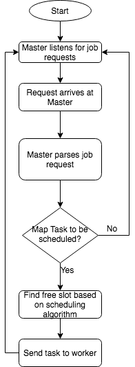
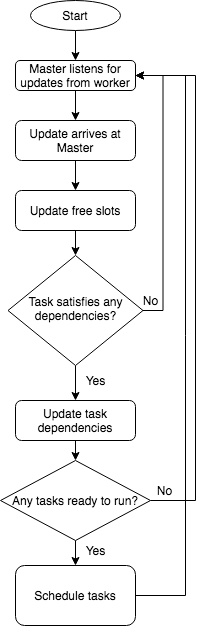

# YACS

<p align="center"><kbd></kbd><p>


This is a multithreaded centralized scheduler with a master/worker architecture. It mimics the nature of Hadoop's YARN for MapReduce on a smaller scale. 

## How To Run

Open a terminal on Linux/WSL. Run the following:

```bash
git clone https://github.com/Sahith02/YACS.git
cd YACS
bash auto_script.sh <number of requests> <Scheduling Algorithm (RANDOM / RR / LL)>
bash auto_kill.sh
bash auto_stats.sh <Same scheduling algorithm used in the first command>
```

#### Example Usage

```bash
bash auto_script.sh 5 RR
bash auto_kill.sh
bash auto_stats.sh RR
```

#### Note
Stop the running process auto_script.sh with CTRL-C  once the number of jobs that have been done equals the number given as the argument (The number of jobs done will be shown on the terminal). This may take a while depending on the number of requests.

## Features

- Works under the Master/Worker architecture.
- Respects Hadoop's MapReduce dependencies.
- Has multiple choices of scheduling algorithms
- Automated bash script to run the worker daemon, master daemon, and client program.
- Uses a multithreaded architecture with mutex locks and semaphores to prevent deadlocks.

## Files and their Functions

### 1. auto_script.sh
This bash script runs each of the worker daemons, master daemon, and the simulated requests from the client (Requests.py) in the background according to the config file given in the `src` directory. This script also stores a list of the process IDs of the daemons in another file in the `temp` directory.

### 2. auto_kill.sh
The above bash script runs each daemon in the background. So even if you stop it with <kbd>CTRL-C</kbd>, it only stops that running bash script process. In order to stop all of the daemons started in the above bash script, each process must be stopped independently. This script opens the list of Process IDs from the `temp` directory and kills them.

### 3. auto_stats.sh
This script runs the statistic modules to compute the mean and median time taken for the completion of each job and each task inside the job. It stores these computed values in a `txt` file in the `stats` folder.

### 4. src folder
- ### A. Config.json
This file contains the metadata of the workers. This file can be configured with different worker IDs, different slots in each worker, etc.

- ### B. Master.py
This python file the master daemon. It starts multiple threads that listen for job requests from the client and distribute the tasks to each worker. It is responsible for managing the available number of slots for each worker and the type of scheduling done, which is given as an argument when running the program. It currently supports 3 different task scheduling algorithms: Random, Round-Robin, and Least-Loaded.

The master on receiving a job from the client segregates the job into map-reduce tasks (it follows MapReduce dependencies from the Hadoop framework) and decides which worker to send a certain task to depending on the scheduling algorithm selected. The master daemon is also protected from deadlocks by using binary semaphores.

<p align="center">
	<kbd></kbd>
	<kbd></kbd>
<p>

- ### C. Requests.py
This is the Client file which sends jobs to the master daemon with exponential delays. It randomly assigns the duration of each task to be simulated by the workers and sends a JSON object in string format to the master.

- ### D. Worker.py
This is the worker daemon which is responsible for the simulation of executing tasks in parallel. It simulates the effect of tasks being done by recalculating the time left for each task in the slot for every wall clock second.

- ### E. stats.py
This module helps calculate the mean and median times taken for each task as well as each job. This module directly analyzes the worker and master logs and also plots a graph depicting the number of tasks in each worker vs. time.

### 5. logs folder
- ### A. master.log
This is the log file for the master daemon which logs 4 different types of actions taken. It logs when a certain job was received, when a task was sent to the worker, when a task was received from the worker, and when a certain job has finished.

- ### B. worker.log
This is the log file for the worker daemon which logs 2 different types of actions. It logs when a specific task was received from the master daemon, and when a task has finished executing in the worker daemon.


### 6. stats folder
This folder has 2 types of files: `png` and `txt`. The image files are the graphs constructed which show the number of tasks plotted against time for each worker. The `txt` files have the calculated statistics, i.e. the mean and median time taken for the tasks and the jobs for each different type of scheduling algorithm.

### 7. temp folder
This folder just holds the PIDs to kill which were created from in the `auto_script.py` in a `txt` format. This file gets overwritten every time the scripts are run.


## Info
This project was done as part of our Big Data course with a team of 4.

## Team
- Sahith Kurapati - [@Sahith02]( https://github.com/Sahith02 )
- Om Shreenidhi - [@om719]( https://github.com/om719 )
- Saksham Gupta - [@saksham49]( https://github.com/saksham49 )
- Vishruth Reddy - [@vishruthreddy18]( https://github.com/vishruthreddy18 )


<div>Logo made by <a href="https://www.designevo.com/logo-maker/" title="Free Online Logo Maker">DesignEvo free logo creator</a></div>
